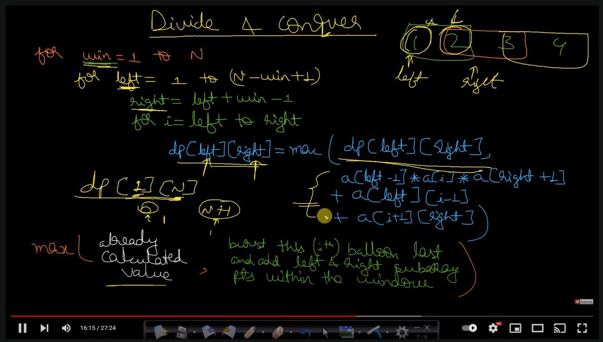

# **day 1:** 312. Burst Balloons

Hard

You are given n balloons, indexed from 0 to n - 1. Each balloon is painted with a number on it represented by an array nums. You are asked to burst all the balloons.

If you burst the ith balloon, you will get nums[i - 1] _ nums[i] _ nums[i + 1] coins. If i - 1 or i + 1 goes out of bounds of the array, then treat it as if there is a balloon with a 1 painted on it.

Return the maximum coins you can collect by bursting the balloons wisely.

**Example 1:**

```
Input: nums = [3,1,5,8]
Output: 167
Explanation:
nums = [3,1,5,8] --> [3,5,8] --> [3,8] --> [8] --> []
coins = 3*1*5 + 3*5*8 + 1*3*8 + 1*8*1 = 167
```

**Example 2:**

```
Input: nums = [1,5]
Output: 10
```

**Constraints:**

- n == nums.length
- 1 <= n <= 500
- 0 <= nums[i] <= 100

**Intuition:**

- The idea is to use DP
- Since it is already given in the question that for any corner cases we can assume that we have one additional balloons on each side of the array, so adding those padding balloon to the vector
- We are basically trying to create windows of sizes from 1 to N
- For every window, we are assigning left and right as the border values of the window
- The left value will move from 1 to (N - window + 1)
- The right value would be left + window - 1
- For every element in the window, we'll iterate over every element as i between left to right
- We'll be using dp table to store the values of the DP.
- Our solution would be the maximum of current values, and the values that would be attained by (bursting the current balloon + left half + right half)



**Solution:**

```
class Solution {
public:
    int maxCoins(vector<int>& nums) {
        nums.insert(nums.begin(), 1);
        nums.push_back(1);
        int n = nums.size();
        vector<vector<int>> dp(n, vector<int>(n, 0));
        int left;
        int right;
        for(int window = 1; window <= (n - 2); window++){
            for(left = 1; left <= (n - window - 1); left++){
                right = left + window - 1;
                for(int i = left; i <= right; i++){
                    dp[left][right] = max(dp[left][right],
                                          (nums[left - 1]*nums[i]*nums[right + 1]
                                          + dp[left][i - 1] + dp[i + 1][right]));
                }
            }
        }
        for(int i = 0; i < n; i++){
            for(int j = 0; j < n; j++){
                cout<<dp[i][j]<<" ";
            }
            cout<<"\n";
        }
        return dp[1][n - 2];
    }
};
```
